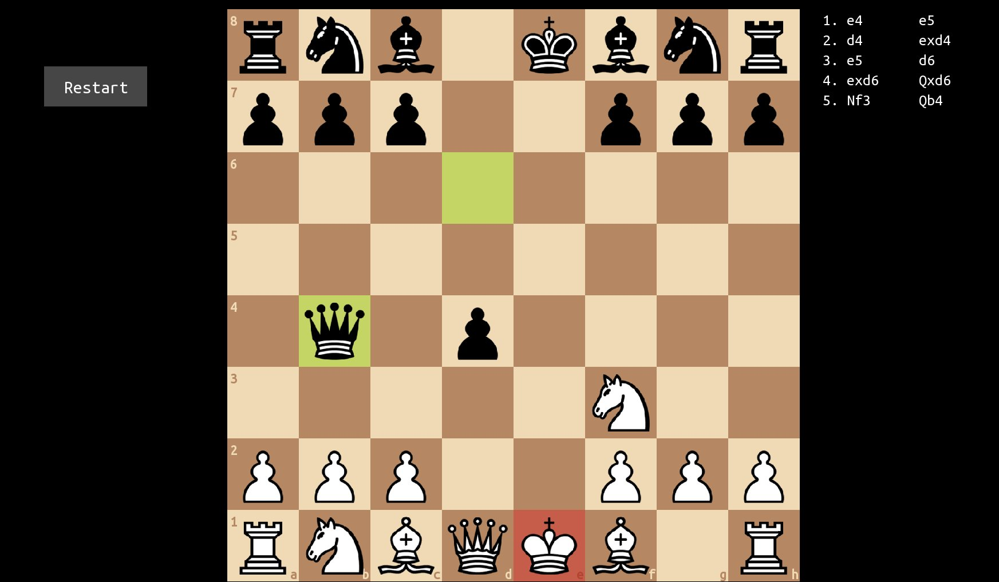

<h1 align="center">♟️ Chess — C++ & SFML</h1>

<p align="center">
  A fully functional two-player chess game built with C++17 and SFML 3, featuring move validation, castling, check/checkmate detection, stalemate, sound effects, move history notation, and a clean graphical interface.
</p>

<p align="center">
  
  
  
  
</p>

---

## Features

- **Complete Chess Rules** — Legal move validation for all pieces: Pawn, Rook, Knight, Bishop, Queen, King
- **Castling** — Both kingside and queenside castling with full legality checks
- **Pawn Promotion** — Pawns automatically promote to Queen upon reaching the back rank
- **Check & Checkmate Detection** — Visual highlight on the king in check; game ends on checkmate
- **Stalemate Detection** — Recognizes draws when no legal moves are available
- **Legal Move Highlighting** — Click a piece to see all valid destination squares shown as dots
- **Last Move Highlighting** — The previous move's start and end squares are highlighted in yellow
- **Move History Notation** — Algebraic-style move log displayed alongside the board
- **Sound Effects** — Distinct sounds for move, capture, castle, check, and checkmate
- **Restart** — In-game button to reset the board at any time

---

## Screenshots

| Gameplay & Move History | Checkmate Detection | King in Check |
|---|---|---|
|  |  |  |

---

## Project Structure

```
Chess/
├── src/                  # C++ source files
│   ├── main.cpp          # Entry point, game loop, rendering
│   ├── Board.cpp         # Board state and display
│   ├── Game.cpp          # Core game logic
│   ├── Move.cpp          # Move validation, castling, notation
│   └── Piece.cpp         # Piece helper functions
├── include/              # Header files
│   ├── Board.hpp
│   ├── Game.hpp
│   ├── Move.hpp
│   ├── MoveStruct.hpp
│   ├── Piece.hpp
│   └── Constants.hpp
├── assets/
│   ├── textures/         # PNG piece sprites (wp, wk, wq, ... bp, bk, bq ...)
│   ├── sounds/           # MP3 sound effects (move, capture, castle, check, checkmate)
│   ├── fonts/            # UbuntuMono-Regular.ttf
│   └── screenshots/      # Game screenshots
├── external/
│   └── SFML-3.1.0/       # Bundled SFML (bin/, include/, lib/)
├── tools/                # Linting and formatting configs
├── .github/workflows/    # CI pipelines (Windows, Ubuntu, macOS, Docs)
└── CMakeLists.txt
```

---

## Getting Started

## Build Instructions

### Clone the Repository

```bash
git clone https://github.com/CrimsonOptimal355/Chess-CPP-SFML.git
cd Chess-CPP-SFML
```

### Configure and Build

```bash
cmake -S . -B build -G "MinGW Makefiles"
cmake --build build
```

> SFML is already bundled in `external/` — no additional setup needed.

### Run the Game

After building, run the executable directly from the `build/` folder — assets and DLLs are automatically copied there by CMake:

```bash
cd build
./Chess.exe
```

> The `assets/` folder and SFML DLLs are automatically copied into `build/` after every successful build.

---

## How to Play

| Action | Input |
|---|---|
| Select a piece | Left click on it |
| Move a piece | Left click on a highlighted destination dot |
| Deselect | Click an invalid square |
| Restart | Click the **Restart** button (left of the board) |

- **White** pieces (uppercase) always move first.
- Valid moves are shown as **grey dots** after selecting a piece.
- The **king's square turns red** when in check.
- The game ends automatically on **checkmate** or **stalemate**.

---

## Requirements

Before building the project, make sure you have:

- **C++17** compatible compiler
  - GCC (MinGW-w64 recommended on Windows)
  - Clang
  - MSVC
- **CMake** 3.15 or higher
- **SFML 3.1.0** — Already bundled in `external/` — no separate download needed ✅

### Tested On

| OS | Compiler | SFML |
|---|---|---|
| Windows 11 | MinGW-w64 | 3.1.0 (bundled) |

---

## Future Scope

- 🤖 **AI Opponent (Minimax)** — Single-player mode with a computer opponent using the Minimax algorithm with alpha-beta pruning
- 🖱️ **Drag-and-Drop Movement** — Intuitive piece dragging instead of click-to-move
- 🎨 **Board Themes** — Switchable board and piece themes for a personalized look

---

## Acknowledgements

- Piece textures inspired by classic chess sets
- Sound effects sourced for chess move/capture/check events
- Font: [Ubuntu Mono](https://fonts.google.com/specimen/Ubuntu+Mono) (SIL Open Font License)
