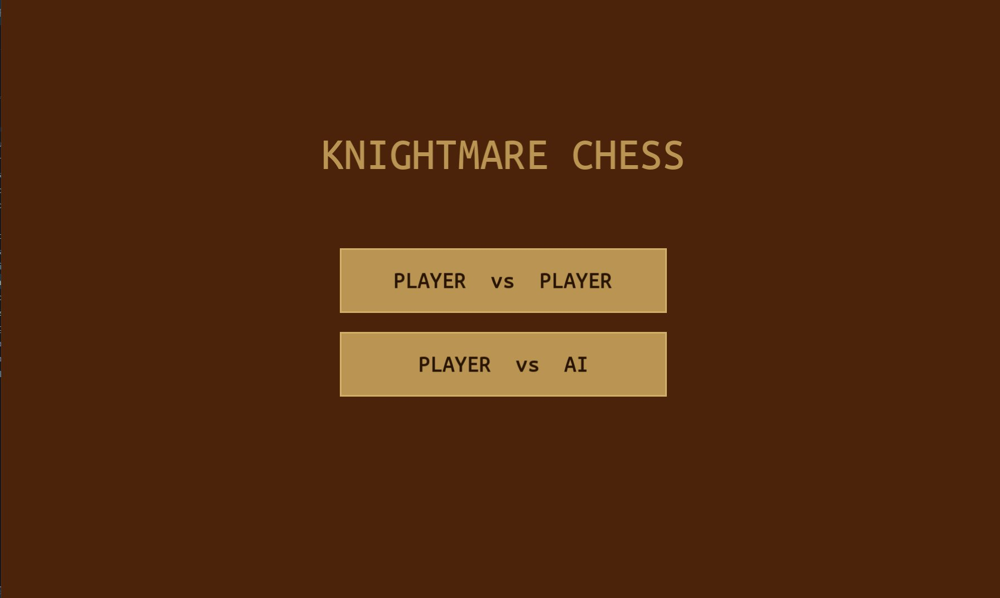
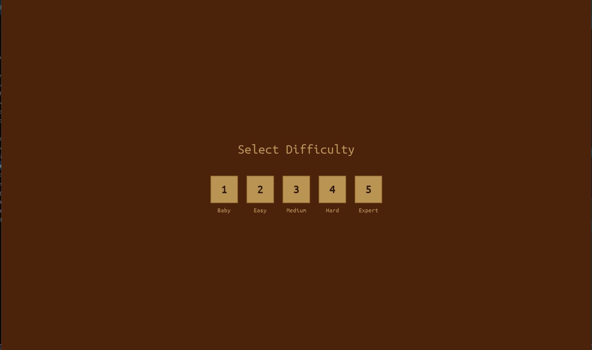
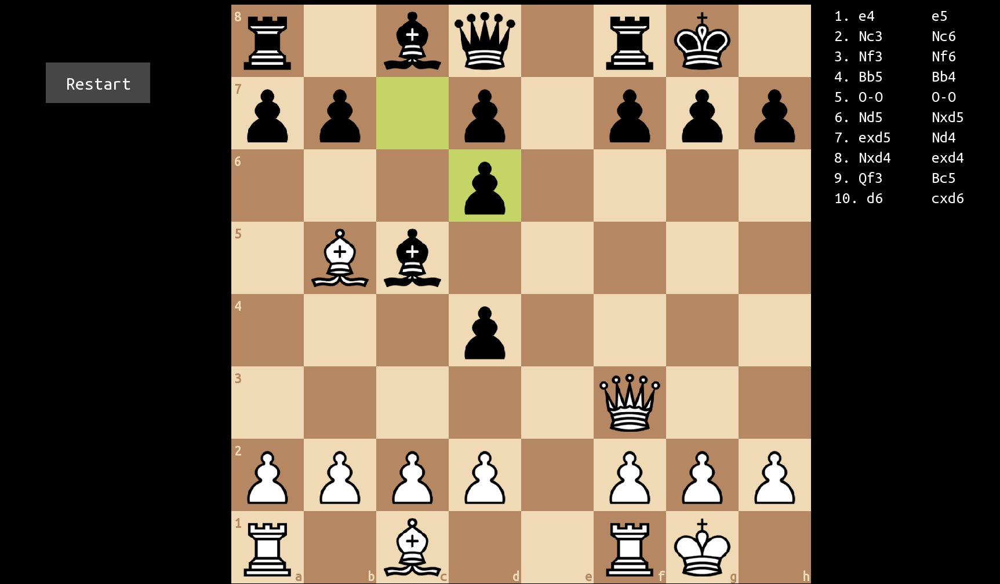
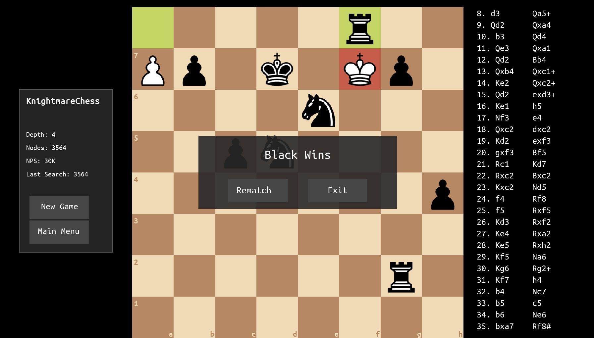

<h1 align="center">♟️ KnightmareChess — C++ & SFML</h1>

<p align="center">
  A fully functional chess game built with C++17 and SFML 3, featuring two-player and AI opponent modes, complete move validation, castling, check/checkmate/stalemate detection, sound effects, move history, and a clean graphical interface.
</p>

<p align="center">
  
  
  
  
  
</p>

---

## Features

### Gameplay
- **Complete Chess Rules** — Legal move validation for all pieces: Pawn, Rook, Knight, Bishop, Queen, King
- **Castling** — Both kingside and queenside castling with full legality checks
- **Pawn Promotion** — Pawns automatically promote to Queen upon reaching the back rank
- **Check & Checkmate Detection** — Visual highlight on the king in check; game ends on checkmate
- **Stalemate Detection** — Recognizes draws when no legal moves are available
- **Legal Move Highlighting** — Click a piece to see all valid destination squares shown as dots
- **Last Move Highlighting** — The previous move's start and end squares are highlighted in yellow
- **Move History Notation** — Algebraic-style move log displayed alongside the board
- **Sound Effects** — Distinct sounds for move, capture, castle, check, and checkmate
- **Restart** — In-game button to reset the board at any time

### Game Modes
- **Player vs Player (PvP)** — Two players take turns on the same machine
- **Player vs AI (PvAI)** — Single-player mode against a computer opponent powered by Minimax with alpha-beta pruning. When selecting this mode, you will be prompted to **choose a search depth** (the number of moves the AI looks ahead):

| Depth | Strength | Speed |
|---|---|---|
| 1 – 2 | Easy | Very fast |
| 3 | Medium | Fast |
| 4 | Hard | May be slow depending on your processor |
| 5 | Hardest | Can be noticeably slow on weaker processors |

> ⚠️ **Depths 4 and 5 significantly increase computation time.** On slower machines, the AI may take several minutes to respond per move.

### AI Engine (`ai.cpp` / `ai.hpp`)
- `evaluateBoard()` — Static board evaluation based on piece values and positioning
- `minimax(depth, maximizing)` — Minimax search algorithm for lookahead decision-making
- `getMinimaxMove(forWhite, depth)` — Returns the best move for the AI at a given search depth
- `getAllLegalMoves(forWhite)` — Enumerates all legal moves for a given side
- Runs on a **separate thread** to keep the UI responsive during AI computation

---

## Screenshots

| Main Menu | Difficulty Selection |
|---|---|
|  |  |
| *Choose between Player vs Player or Player vs AI* | *Pick a difficulty from Baby (1) to Expert (5) before the game starts* |

| In-Game with Move History | Checkmate |
|---|---|
|  |  |
| *Live board with algebraic move log, last-move highlight, and king-in-check indicator* | *"Black Wins" displayed on checkmate with the full move history on the right* |

---

## Project Structure

```
KnightmareChess/
├── src/
│   ├── main.cpp          # Entry point, main menu, game loop, rendering
│   ├── Board.cpp         # Board state and display
│   ├── Move.cpp          # Move validation, castling, notation
│   └── ai.cpp            # AI engine (Minimax + alpha-beta pruning)
├── include/
│   ├── Board.hpp
│   ├── Move.hpp
│   ├── MoveStruct.hpp
│   └── ai.hpp
├── assets/
│   ├── textures/         # PNG piece sprites (wp, wk, wq, ... bp, bk, bq ...)
│   ├── sounds/           # Sound effects (move, capture, castle, check, checkmate)
│   ├── fonts/            # UbuntuMono-Regular.ttf
│   └── screenshots/      # Game screenshots
├── external/
│   └── SFML-3.1.0/       # Bundled SFML (bin/, include/, lib/)
├── tools/                # Linting and formatting configs
└── CMakeLists.txt
```

---

## Requirements

- **C++17** compatible compiler (GCC/MinGW-w64, Clang, or MSVC)
- **CMake** 3.15 or higher
- **SFML 3.1.0** — Already bundled in `external/` — no separate download needed ✅

### Tested On

| OS | Compiler | SFML |
|---|---|---|
| Windows 11 | MinGW-w64 | 3.1.0 (bundled) |

---

## Build Instructions

### Clone the Repository

```bash
git clone https://github.com/CrimsonOptimal355/KnightmareChess.git
cd KnightmareChess
```

### Configure and Build

```bash
cmake -S . -B build -G "MinGW Makefiles"
cmake --build build
```

> SFML is already bundled in `external/` — no additional setup needed.

### Run the Game

After building, run the executable from the `build/` folder — assets and DLLs are automatically copied there by CMake:

```bash
cd build
.\Chess.exe
```

---


## How to Play

| Action | Input |
|---|---|
| Select a piece | Left click on it |
| Move a piece | Left click on a highlighted destination dot |
| Deselect | Click an invalid square |
| Restart | Click the **Restart** button (left of the board) |

- **White** pieces always move first.
- Valid moves are shown as **grey dots** after selecting a piece.
- The **king's square turns red** when in check.
- The game ends automatically on **checkmate** or **stalemate**.
- On the main menu, choose between **PvP** (two players) or **PvAI** (play against the computer).
- In **PvAI mode**, you will be asked to select a **search depth** before the game starts. Lower depth = faster AI; higher depth = stronger but slower AI (depth 4–5 can be slow on weaker processors).

---

## Acknowledgements

- Piece textures inspired by classic chess sets
- Sound effects sourced for chess move/capture/check events
- Font: [Ubuntu Mono](https://fonts.google.com/specimen/Ubuntu+Mono) (SIL Open Font License)


